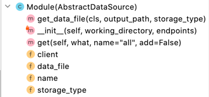

Developer's Guide
=================

DHTK is an open-source team effort. Contributions are essential to our
survival and growth. We are thankful for any contribution and are happy
to welcome you to the DHTK community!

You can contribute to DHTK in many ways:
-   Contribute to the development of new extensions
-   Sending us feedback with suggestions or let us know of any issue you
    run into while using DHTK.
-   Add or modify minor functionalities to DHTK

New data sources
----------------

If you would like to integrate a new dataset to DHTK, please write to
[Davide Picca](https://www.unil.ch/sli/davidepicca) to let us know!

DHTK modular structure is thought out to simplify integrating new
modules, features and datasets. DHTK is technically divided into three parts as
described in the [documentation](user_guide.md) page. The three parts are
organised in separate directories (core, data sources, storage) for
easier identification and navigation during development. This guarantees
that the new data sources functions as a self-contained module, independent
of the core DHTK modules.

**Set up DHTK**

1. Please visit our [GitHub page](https://github.com/dhtk-unil/dhtk) to find
    detailed information on how to contribute.
2. Add an issue to the repository to let us know what you will be
    working on and request the access[^1].
3. Clone the DHTK repository and create your own branch.

[^1]: DHTK will be soon publicly available.

**Develop module**

4. Develop you module independently.
5. Remember to re-use (import) functions and classes already available
    on DHTK ([how to add/modify helpers](#minor-changes))

**Integrate module**

6. Creating a new folder under the extension directory with the new
    module's name.
7. If you're using a new curated dataset, make the RDF file available
    ([see RDF Dataset](#rdf-dataset))
8. Integrate your module (after testing) into DHTK's framework ([see
    Integrating new modules](#integrating-new-modules))
9. Submit your changes for review as a pull request.

Your request will be discussed and reviewed and soon as possibly using
the normal [Github
interface](https://docs.github.com/en/free-pro-team@latest/github/collaborating-with-issues-and-pull-requests/commenting-on-a-pull-request).

### Integrating new modules

DHTK core module is responsible to locate and load any module within
the data source directory. Due to the modular architecture of DHTK, these
data sources can be easily developed as self-sufficient Python modules,
which are integrated into the DHTK framework through their path
`dhtk.data_sources.gutenberg` for example.

*Note*:

All dhtk data sources should be named `dhtk.data_source.DATASOURCE_NAME` (i.e. `dhtk.data_source.gutenberg`) so
that everyone can find them on the net.

#### Procedure

We provide [4 different data storages](https://gitlab.com/dhtk/dhtk_data_sources/examples) already setup 
and ready to use.
- `dhtk_data_source_dummysql`: blueprint package to be used if you need SQL storage (MariaDB)
- `dhtk_data_source_dummynosql`: blueprint package to be used if you need NoSQL storage (MongoDB)
- `dhtk_data_source_dummytei`: blueprint package to be used if you need XML-TEI storage (BaseX)
- `dhtk_data_source_dummytriplestore`: blueprint package to be used if you need RDF storage (Fuseki)

**Creating a data source**

1. Clone one of the 4 bleuprint available
2. Define `name`and `data_file` variables as shown in Figure [1](#variables) 
3. Complete the Module class by defining at least the required
    attributes and methods: `get_data_file` , `__init__` and `get`
4. Update the `README.md` and `setup.py` to make the module installable.

**Data source integration into dhtk**

The DHTK `AbstractDataSource` abstract class contains most of the required
methods to prepare a module for use. The new **Module class** is
essentially a wrapper around a DHTK data source, defining the attributes
**name** and **url** (name of the data source and location of the RDF data
file to use on with the local SPARQL endpoint), and the **methods to
query and save the results**. Any additional method that improves the
Module class can be freely included.

****Gutenberg example****

**1. Create a module specific directory**: The gutenberg subdirectory
was created on the dhtk's extension directory. All the files from the
previously tested independent module are moved to this folder.

**2. Add the class named Module to the \_\_init\_\_ file**

**3.1. Defining attributes**

The general attributes *name* and *url* can be defined withing the
class' \_\_init\_\_ method:

-   *name* defines the the name of the module and should be the same as
    the directory place under dhtk/extensions
-   *url* define the remote location of the dataset to be set up
    locally.
---
 **note**

 More specific attributes are defined to better integrate the gutenberg
 module: *\_corpus* and *wrapper*. In this case, *\_corpus* is used
 store retrieved books while the *wrapper* attribute is used to
 reference the GutenbergData "query" object
---
**3.2. Defining .get and .save methods**

Two methods are required to be defined: .get() and save().

The *get(what, name, add)* provides functions as the main point for DHTK
integration. This method takes three arguments, converts then into
SPARQL queries using a conditional logic and calls the correct module
functionalities to retrieve information.

-   *what*: a string value determining what is being searched for
    (*e.g.* books, authors). This value is evaluated by a conditional
    if-then-else logic, wrapping around the main module query calls with
    a user-friendly and unified framework.
-   *name*: a string value identifying of what is being searched (*e.g.*
    book name, author name). This value is used to narrow down the
    general query defined by *what*, retrieving specific instances.
-   *add*: a boolean value defining if the query results should be added
    to the records (*e.g.* corpus) or if the user wishes to search
    interactively instead.

The records generated when using *get(add=True)* are used by the
*.save()* method to store all the retrieved data on disk by calling all
relevant methods from the extension.

**3.3. Defining additional methods**

Gutenberg's Module class contains two extra methods. The suggested
*welcome()* method automatically provides the user with the dataset
statistics. This method is automatically called when a module is loaded,
and can be used to provide the user with any (or no) information.

The *corpus* method is not defined in parent AbstractExtension class,
but it provides a simpler way to modify a corpus' settings and retrieve
its representation, being a convenient intermediate method to search for
book and author information.

Feedback and issues
-------------------

As DHTK grows, we aim to make it more efficient, simpler and contain
more functionalities relevant to the Digital Humanities' community. Even
if you do not have the computational expertise to program in Python, you
can contribute as part of the DHTK community by letting us know how to
improve DHTK to best fit your research needs.

If you have any question, suggestion or feedback please
write to Davide Picca \<https://www.unil.ch/sli/davidepicca\>

*All suggestions and feedback are welcomed!*

Minor changes
-------------

If you think DHTK is missing some simple functionality or could be made
simpler and easier in some way, and you want to contribute by helping us
implement those changes, thank you! However, before you do so, please
write to [Davide Picca](https://www.unil.ch/sli/davidepicca) to let us
know!

As a collective effort, we remain an open to everyone's contributions.
Everyone can add or modify any function, class or method to improve DHTK
usability of an existing DHTK module easily:

1. Please visit our [GitLab page](https://gitlab.com/dhtk/dhtk) to
    find detailed information on how to contribute.
2. Add an issue to the repository to let us know what you will be
    working on.
3. Clone the DHTK repository and create your own branch.
4. Address the issue by modifying and testing the code locally.
5. Submit your changes for review as a pull request.

Your request will be discussed and reviewed and soon as possibly using
the normal [Github
interface](https://docs.github.com/en/free-pro-team@latest/github/collaborating-with-issues-and-pull-requests/commenting-on-a-pull-request).

### RDF Dataset

If the new extension module uses a new pre-processed dataset, the
finalised RDF file should be made available to download so it can be
added to the local Fuseki endpoint. These files can be stored in any
remote location, as long as freely accessible, though we would recommend
using [Zenodo](https://about.zenodo.org/).

For reproducibility and transparency, the full pipeline used to produce
the provided RDF file (including clear instructions on how to use it)
should also be made available under the **"builder directory"** of the
module *(e.g. dhtk/extensions/gutenberg/builder/)*