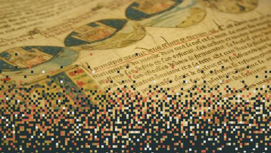

   

Welcome to DHTK's documentation!
================================

In recent years, the digital humanities have received particular
attention from both the humanities community and from computer science.
Scholars working in Digital Humanities research often need to access to
a range of data regarding cultural data.

The Internet is a great source for searching and retrieving this type of
information, and archives such as Project Gutenberg, Europeana,
Archive.org, *and similia*, provide many datasets relevant to the
research scientists. However, many of these resources are organized and
structured in different ways and are often incompatible, having
different APIs and different metadata structures, which make these
repositories difficult to exploit.

In addition, a number of powerful automated methods for analyzing text,
sound, and images have been developed, but these tools are technically
difficult or do not adequately fit the needs of the humanities
community.

As a result, finding resources, checking metadata, and finally
processing cultural data and metadata, can be a long, tedious, and
complex process.

By introducing the Digital Humanities Tool Kit (DHTK), we propose a new
python library whose purpose is to overcome these limitations by
providing an intuitive tool for large-scale study of large cultural
databases, exploiting state-of-the-art computational methods to support
and simplify research in the Digital Humanities.

**Features**

-   Easy to use
-   Access to a wide range of literary works
-   The ability to analyze resources in an extended way
-   Efficient and time effective

**Publications**

-   Davide Picca and Mattia Egloff, [DHTK: The Digital Humanities
    ToolKit](https://pdfs.semanticscholar.org/b9fd/9f58aaec580e8feba2ee9ff3a69cdc079620.pdf),
    WHiSe 2017
-   Mattia Egloff, Alessandro Adamou, Davide Picca, [Enabling
    Ontology-Based Data Access to Project
    Gutenberg](http://ceur-ws.org/Vol-2695/), WHiSe 2020

**Changelog**

    
 <b> Version 1.0.2 </b> 

    <ul>
        <li> Unified framework for simplified programmatic access </li>
        <li> Modularisation and addition of "module wrapper template" for easier  integration of additional modules</li>
        <li> Automated DHTK's system check, including local Docker installation and configuration checks for local endpoints (macOS only)</li>
    </ul>

    
 <b>Version 1.0.1 </b>

    <ul>
        <li>*"Clean Text"* module to remove Gutenberg's header, footer and
        footnotes</li>
        <li>*"Test"* files that will help us provide you with a stable working
        toolkit, as well as help in adding new features and implementing
        contributions from the community</li>
    </ul>

